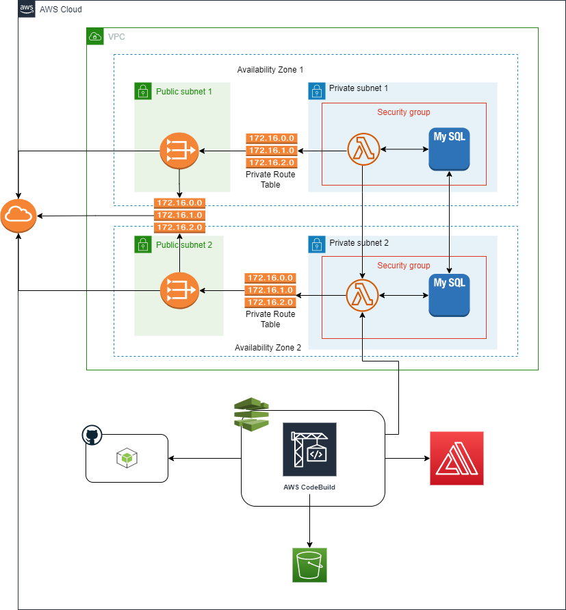

# Web Application Deployment on AWS

This repository contains the infrastructure and CI/CD pipeline setup for XYZ LLC's web application. The application consists of a React/Next.js frontend, a Node.js backend hosted on AWS Lambda, and a MySQL database hosted on Amazon RDS. 

## Table of Contents
1. [Architecture Overview](#architecture-overview)
2. [Codebase Structure](#codebase-structure)
2. [Infrastructure Provisioning](#infrastructure-provisioning)
    - [Prerequisites](#prerequisites)
    - [Setup Instructions](#setup-instructions)
3. [CI/CD Pipeline Setup](#cicd-pipeline-setup)
    - [AWS CodePipeline](#aws-codepipeline)
    - [AWS CodeBuild](#aws-codebuild)
    - [AWS Amplify](#aws-amplify)
4. [Monitoring and Logging](#monitoring-and-logging)
    - [CloudWatch Configuration](#cloudwatch-configuration)
    - [Setting Up Alarms](#setting-up-alarms)

## Architecture Overview

The architecture of the web application includes:

- A Virtual Private Cloud (VPC) with public and private subnets across multiple availability zones.
- AWS Lambda functions for the backend Node.js services.
- An RDS instance for the MySQL database.
- Security Groups to control access to the database.
- IAM roles and policies to secure and manage access to AWS resources.
- AWS Amplify for the React/Next.js frontend deployment.

  
  
## Codebase Structure  

The codebase structure is given below:  
   
```
armorserv-devops-task
│   .gitignore
│   amplify_buildspec.yml        
│   deploy.sh
│   infra_achitecture.drawio.png 
│   lambda_buildspec.yml
│   README.md
│
├───.github
│   └───workflows
│           infra-deploy.yaml
│
├───backend
│       backend.js
│
├───frontend
│       package-lock.json    
│       package.json
│
└───infra_setup
    │   backend.tf
    │   dev-infra.tfvars
    │   main.tf
    │   prod-infra.tfvars
    │   provider.tf
    │   stg-infra.tfvars
    │   variables.tf
    │
    └───modules
        ├───amplify
        │       main.tf
        │       output.tf
        │       variables.tf
        │
        ├───codebuild
        │       main.tf
        │       output.tf
        │       variables.tf
        │
        ├───codepipeline
        │       main.tf
        │       variables.tf
        │
        ├───compute
        │       main.tf
        │       output.tf
        │       variables.tf
        │
        ├───database
        │       main.tf
        │       variables.tf
        │
        ├───iam
        │       lamda_role.tf
        │       outputs.tf
        │       pipeline_role.tf
        │       rds_role.tf
        │       variables.tf
        │
        └───network
                gateways.tf
                outputs.tf
                route_tables.tf
                security_groups.tf
                subnet.tf
                variables.tf
                vpc.tf
```

## Infrastructure Provisioning

### Prerequisites

1. Install [Terraform](https://www.terraform.io/downloads.html).
2. AWS CLI configured with appropriate permissions.
3. AWS account with administrative access.
4. Terraform code in `infra_setup` directory.

### Setup Instructions

1. **Clone the repository:**

   ```bash
   git clone https://github.com/kennedyuc/armorserv-devops-task
   
   cd infra_setup
   ```

2. **Set the terraform variables values as needed:**  
  
   This can be done from the `<env>-infra.tfvars` file within the `infra-setup` directory. The values you set depends on the target environment.  
    
3. **Run the terraform init command:**  
   
   This initializes terraform and connect to the S3 bucket backend.  
     
   ```bash
   terraform init \
        -reconfigure \
        -backend-config="bucket=<TF_BACKEND_BUCKET>" \
        -backend-config="key=<env>/terraform.tfstate" \
        -backend-config="region=<AWS_REGION>"
   ```

4. **Run the terraform format command:**  
   
   This formats the terraform scripts properly.  

   ```bash
   terraform fmt
   ```  

5. **Run the terraform plan command:**  
  
   This plans the changes to be made to the current terraform state in the backend and outputs the terraform state data.
     
   ```bash
   terraform plan --var-file=<env>-infra.tfvars -out=plan.tfdata
   ```  

6. **Run the terraform apply command:**  
  
   This applies the terraform state data output from the plan above. Execute the command after reveiwing the planned state of the infrastructure.  
     
   ```bash
   terraform apply -auto-approve plan.tfdata
   ```  

## CI/CD Pipeline Setup  
  
The CI/CD Pipeline consists of AWS CodePipeline, CodeDeploy, Lambda Function (for backend) and Amplify (for frontend). The source code is hosted in Github which is connected to the AWS resources. The resources are already created in the Terraform deployment.  
  
The setup steps are given below.  
  
### AWS CodePipeline  
The CodePipeline configuration:  
  
```bash
resource "aws_codepipeline" "codepipeline" {
  name     = "test-codepipeline"
  role_arn = var.codepipeline_iam_arn

  artifact_store {
    location = var.artifact_bucket
    type     = "S3"
  }

  stage {
    name = "Source"

    action {
      name             = "Source"
      category         = "Source"
      owner            = "ThirdParty"
      provider         = "GitHub"
      version          = "1"
      output_artifacts = ["source_output"]

      configuration = {
        Owner  = var.github_owner
        Repo   = var.github_repo
        Branch = var.github_branch
        OAuthToken = var.github_token
      }
    }
  }

  stage {
    name = "Build"

    action {
      name             = "BuildFrontend"
      category         = "Build"
      owner            = "AWS"
      provider         = "CodeBuild"
      input_artifacts  = ["source_output"]
      output_artifacts = ["frontend_build_output"]

      configuration = {
        ProjectName = var.frontend_build_name
      }
    }

    action {
      name             = "BuildBackend"
      category         = "Build"
      owner            = "AWS"
      provider         = "CodeBuild"
      input_artifacts  = ["source_output"]
      output_artifacts = ["backend_build_output"]

      configuration = {
        ProjectName = var.backend_build_name
      }
    }
  }

  stage {
    name = "DeployFrontend"

    action {
      name             = "Deploy"
      category         = "Deploy"
      owner            = "AWS"
      provider         = "Amplify"
      input_artifacts  = ["frontend_build_output"]

      configuration = {
        AppId = var.amplify_app_id
        BranchName = var.github_branch
      }
    }
  }

  stage {
    name = "DeployBackend"

    action {
      name             = "Deploy"
      category         = "Deploy"
      owner            = "AWS"
      provider         = "Lambda"
      input_artifacts  = ["backend_build_output"]

      configuration = {
        FunctionName = var.lambda_function_name
      }
    }
  }

  tags = {
    Name = "${var.project_name}-${var.env}-pipeline"
    Env  = var.env
  }
}
```

### AWS CodeBuild  
  
The CodeBuild configuration:  
  
```bash
resource "aws_codebuild_project" "frontend" {
  name          = "frontend-build"
  service_role  = var.codebuild_arn
  artifacts {
    type = "S3"
    location = var.artifact_bucket
    path = "frontend/"
  }
  environment {
    compute_type = var.compute_instance
    image = var.compute_image_name
    type = var.compute_image_type
  }
  source {
    type = "GITHUB"
    location = "https://github.com/${var.github_owner}/${var.github_repo}.git"
    buildspec = file("amplify_buildspec.yml")
  }
}

resource "aws_codebuild_project" "backend" {
  name          = "backend-build"
  service_role  = var.codebuild_iam_arn
  artifacts {
    type = "S3"
    location = var.artifact_bucket
    path = "backend/"
  }
  environment {
    compute_type = var.compute_instance
    image = var.compute_image_name
    type = var.compute_image_type
    environment_variable {
      name  = "function_name"
      value = var.lambda_function_name
    }
    environment_variable {
      name  = "alias_name"
      value = var.env
    }
  }
  source {
    type = "GITHUB"
    location = "https://github.com/${var.github_owner}/${var.github_repo}.git"
    buildspec = file("lambda_buildspec.yml")
  }

  tags = {
    Name = "${var.project_name}-${var.env}-codebuild"
    Env  = var.env
  }
}
```  
  
### AWS Amplify  
  
The Amplify configuration:  
  
```bash
resource "aws_amplify_app" "amplify_app" {
  name = "amplify-app"

  repository = "https://github.com/${var.github_owner}/${var.github_repo}"
  oauth_token = var.github_token

  environment_variables = {
    _LIVE_PACKAGE_SCAN = "false"
  }

  build_spec = file("amplify_buildspec.yml")

  custom_rules {
    source = "</^[^.]+$|\\.(?!(css|gif|ico|jpg|js|png|txt|svg|woff|woff2)$)([^.]+$)/>"
    target = "/index.html"
    status = "200"
  }

  tags = {
    Name = "${var.project_name}-${var.env}-frontend"
    Env  = var.env
  }
}
```  
  
## Monitoring and Logging  
  
CloudWatch is enabled for the Lambda function execution policy in the terraform setup above.  
  
The policy configuration:  
  
```bash
{
    Sid      = "AllowCloudWatchLogs",
    Action   = [
        "logs:CreateLogGroup",
        "logs:CreateLogStream",
        "logs:PutLogEvents"
    ],
    Resource = "arn:aws:logs:*:*:*",
    Effect   = "Allow"
}
```  
  
A bash script is included in the root directory for running the alarm setup using AWS CLI commands.  
  
Run the command:  
  
```bash
./metrics_alerts_setup.sh
```
